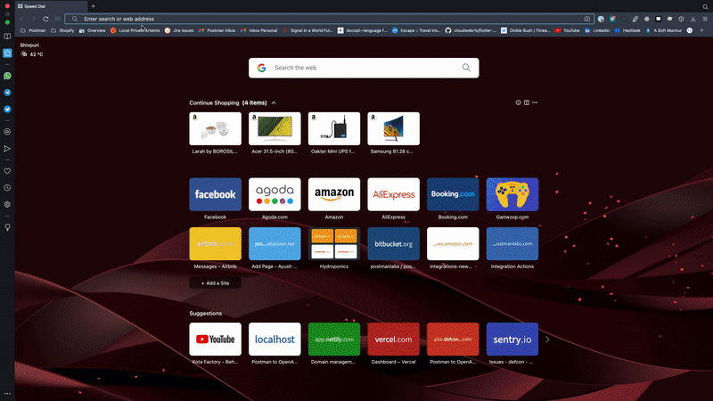
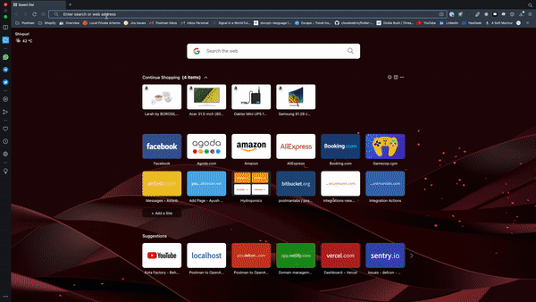

# Postman to OpenAPI online converter

A small utility to convert Postman <a href='https://www.postman.com/collection/' target='_blank'>collections</a> to <a href='https://www.openapis.org/' target='_blank'>Open API</a> schema in one click.
All the conversion happens on your browser itself hence your collection data is completely secure and no data is exchanged after page is loaded.

You can either load the collection from an exported JSON or directly use the collection URL.
## 🏠 [Homepage](https://p2o.defcon007.com)

## ✨ Demo
#### Convert collection JSON file to OpenAPI schema

#### Convert collection via URL to OpenAPI schema

### Installation

**Option one:** One-click deploy

**Option two:** Manual clone

1. Clone this repo: `git clone https://github.com/DefCon-007/postman-to-openapi-online.git`
2. Use supported node version by `nvm use`
3. Navigate to the directory and run `npm install`
4. Run `npm run dev`
5. Make your changes
